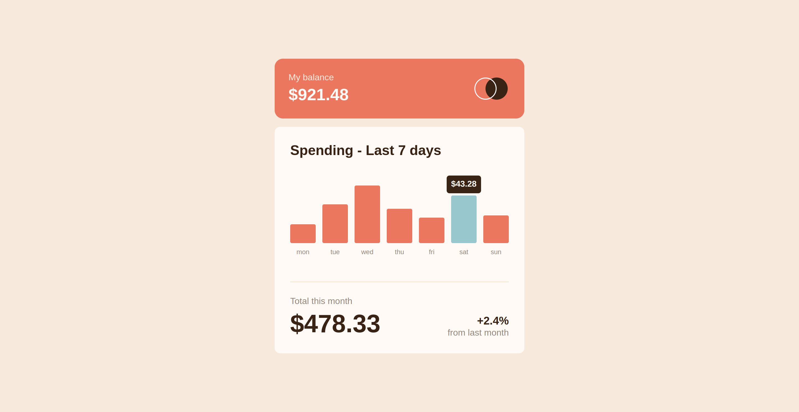
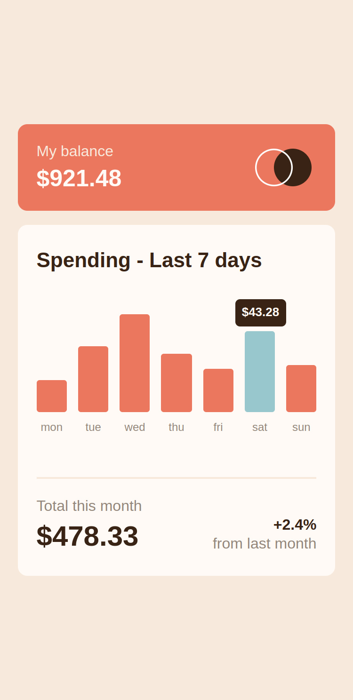

# Frontend Mentor - Solución del componente de gráfico de gastos

Esta es una solución al [desafío del componente de gráfico de gastos en Frontend Mentor](https://www.frontendmentor.io/challenges/expenses-chart-component-e7yJBUdjwt). Los desafíos de Frontend Mentor te ayudan a mejorar tus habilidades de codificación mediante la creación de proyectos realistas.

## Índice

- [Frontend Mentor - Solución del componente de gráfico de gastos](#frontend-mentor---solución-del-componente-de-gráfico-de-gastos)
  - [Índice](#índice)
  - [Descripción general](#descripción-general)
    - [El desafío](#el-desafío)
    - [Captura de pantalla](#captura-de-pantalla)
      - [Diseño Escritorio](#diseño-escritorio)
      - [Diseño Movil](#diseño-movil)
    - [Enlaces](#enlaces)
  - [Mi proceso](#mi-proceso)
    - [Creado con](#creado-con)
  - [Autor](#autor)

## Descripción general

### El desafío

Los usuarios deberían poder:

- Ver el gráfico de barras y pasar el cursor sobre las barras individuales para ver las cantidades correctas para cada día
- Ver la barra del día actual resaltada en un color diferente al Otras barras
- Ver el diseño óptimo para el contenido según el tamaño de la pantalla de su dispositivo
- Ver los estados de desplazamiento de todos los elementos interactivos en la página
- **Bonus**: Use el archivo de datos JSON provisto para cambiar el tamaño de las barras en el gráfico de manera dinámica

### Captura de pantalla

#### Diseño Escritorio

#### Diseño Movil

### Enlaces

- URL de la solución: [GitHub](https://github.com/jean266/componete_cuadro_gastos)
- URL del sitio en vivo: [Vercel](https://componete-cuadro-gastos.vercel.app/)

## Mi proceso

### Creado con

- Marcado HTML5 semántico
- Propiedades personalizadas CSS
- Flexbox
- Flujo de trabajo para dispositivos móviles
- Gulp
- SASS
- 
## Autor

- Mentor de frontend: [@jean266](https://www.frontendmentor.io/profile/jean266)
